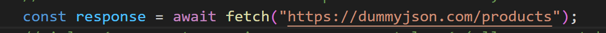
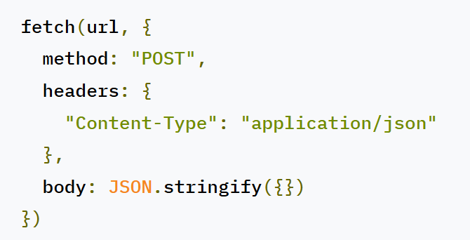

# Exemple react fetch API (by Rifi Agznay Ryad)

En informatique, une interface de programmation d’application1 ou interface de programmation applicative2,3, souvent désignée par le terme API pour « application programming interface » en anglais, est un ensemble normalisé de classes, de méthodes, de fonctions et de constantes qui sert de façade par laquelle un logiciel offre des services à d'autres logiciels. Elle est offerte par une bibliothèque logicielle ou un service web, le plus souvent accompagnée d'une description qui spécifie comment des programmes « consommateurs » peuvent se servir des fonctionnalités du programme « fournisseur ». --wikipedia

Dit autrement, une API aura pour but de répondre à différente requête provenant du client.
Il pourra : fournir des données, créer de nouvelle donnée, modifier des données ou supprimer des données.
le client (notre programme react) communique avec ce service en ligne via des requêtes HTTP possible grace à la fonction fetch (il existe d'autre outils en react pour envoyer des requêtes HTTP)

## 1. fetch

native à JS, c'est une fonction qui lance une requête sur internet et qui retourne une réponse.

par défaut le fetch est une requête de type GET (çàd qu'il veut uniquement récupèrer quelques chose)

si vous voulez faire une requête de type POST ou fournir des token à votre requête, fournissez les dans le second paramètre de fetch:

